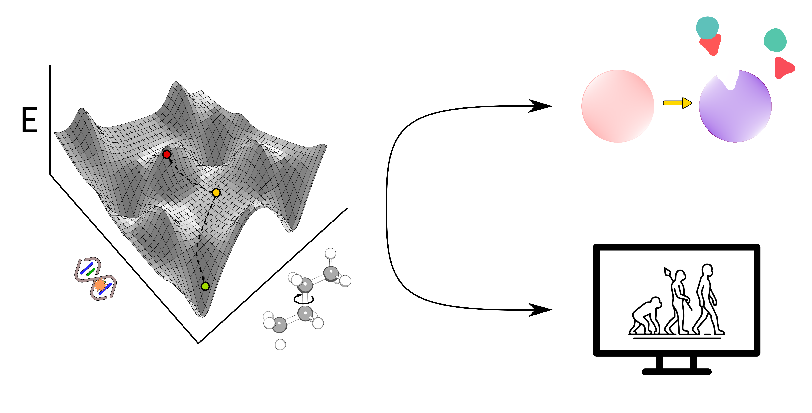

# AsiteDesign

AsiteDesign combines [PyRosetta](http://www.pyrosetta.org/) modules with enhanced sampling techniques to both design catalytic residues, as well as, perform in silico directed evolution of an existing active site.

## Installation

A set of Python libraries are necessary to run the scripts of this Git repository; mainly OpenMM, PyRosetta, and Biotite.
* python setup.py 

## Requirements

* Python Python 3.7 or higher must be installed.
* PyRosetta (licensed software), Biotite, MDAnalysis, MPI4py, OpenMM.

## Usage

To run AsiteDesign, you need the following:

* An input PDB file with the complex (ligand docked to the protein, otherwise the ligand can be placed by the code, but it's better to have it already bound)
* The parameters of all ligands, cofactors, and non-conventional amino acids that appear in the simulation (to generate them, for instance, save the ligand as mol2 file from Pymol. Then, use the facilitated molfile\_to\_params Python script to transform to a params file)

To start using it, the parameters that should be set in the input yaml file are the following:

* PDB --> Add the name of your input PDB file
* ParameterFiles --> Add the name of all the used params files (list them with "-")
* Name --> Add the name of the desired output folder
* DesignResidues --> Add the list of residues allowed to be mutated (ZZ leaves the residue as frozen. ZX stands for not mutable, but repackable. XX stands for mutable and repackable and XX+ adds the option to use the native residue as well. You can also specify to which residues you want to allow it to mutate by listing them, for instance, 100-A: AILFWVPY)
* CatalyticResidues --> Specify the number of residues of the active site that wants to be added (RES1, RES2 ... RESN: H)
* Ligands, 1-L (you have to specify the ligand by giving the residue number and the chain of the specific LIG). Also, the torsions that want to be excluded must be specified by the user ("ExcludedTorsions")
* Constraints --> Add the distance and sequence constraints that you want. The distance constraints should be added by passing two residues (with residue\_number-chain) and two atoms (atomname) and to which values you want to constraint them (lb: value in angstroms, hb: value in angstroms)
* nIterations --> Number of adaptive sampling epochs that want to be performed
* nSteps --> Number of steps performed in each epoch/iteration
* nPoses --> Number of final poses (mutants/designs) to be reported (each one given to a processor/CPU)
* Time --> Time in the queue (if it's run in a cluster)
	
To get a better understanding, check the examples (both yaml files) in the Templatized\_control\_file folder

## Citation

If AsiteDesign is used in one of your publications, please cite the paper: {add reference to doi here}

## Contact

For any queries, feel free to ask us:

Masoud Kazemi, ([@masoudk](https://github.com/masoudk)), Biomatter Designs, Vilnius, Lithuania
Sergi Roda, ([@SergiR1996](https://github.com/SergiR1996)), Barcelona Supercomputing Center, Barcelona, Spain
